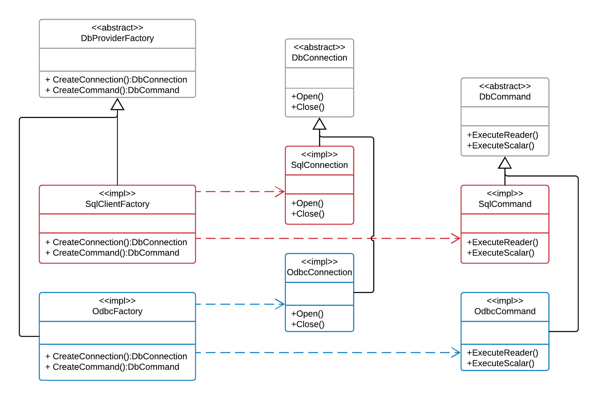

What is abstract factory pattern?


See [Wikipedia](https://en.wikipedia.org/wiki/Abstract_factory_pattern), [dofactory](https://www.dofactory.com/net/abstract-factory-design-pattern), [Sourcemaking](https://sourcemaking.com/design_patterns/abstract_factory), [oodesign](https://www.oodesign.com/abstract-factory-pattern.html), etc..

.NET framework uses/implements many design patterns, abstract factory is one such.

`System.Data.Common.DbProviderFactory` is an implementation of abstract factory pattern. Every method in this class is an implementation of Factory method pattern.

`DbProviderFactory` is inherited by the following Concrete factories `SqlClientFactory`, `OdbcFactory`, `OracleClientFactory`, etc. They implement the operations declared in `DbProviderFactory` to communicate with specific database implementations.

Every concrete factory can build a Concrete product, in this case, `SqlClientFactory.CreateConnection()` will return an abstract `DbConnection` whose concrete type will be a `SqlConnection` instance.


```csharp
public abstract class DbProviderFactory
{
    public virtual DbCommand CreateCommand()
    {
      return (DbCommand) null;
    }

    public virtual DbCommandBuilder CreateCommandBuilder()
    {
      return (DbCommandBuilder) null;
    }

    public virtual DbConnection CreateConnection()
    {
      return (DbConnection) null;
    }

    public virtual DbConnectionStringBuilder CreateConnectionStringBuilder()
    {
      return (DbConnectionStringBuilder) null;
    }

    public virtual DbDataAdapter CreateDataAdapter()
    {
      return (DbDataAdapter) null;
    }

    public virtual DbParameter CreateParameter()
    {
      return (DbParameter) null;
    }

    public virtual CodeAccessPermission CreatePermission(PermissionState state)
    {
      return (CodeAccessPermission) null;
    }

    public virtual DbDataSourceEnumerator CreateDataSourceEnumerator()
    {
      return (DbDataSourceEnumerator) null;
    }

    public virtual bool CanCreateDataSourceEnumerator
    {
      get
      {
        return false;
      }
    }
}
```

Usage of `DbProviderFactory`:

```csharp
// Source: https://docs.microsoft.com/en-us/dotnet/framework/data/adonet/obtaining-a-dbproviderfactory
// Given a provider name and connection string,
// create the DbProviderFactory and DbConnection.
// Returns a DbConnection on success; null on failure.
static DbConnection CreateDbConnection(string providerName, string connectionString)
{
    // Assume failure.
    DbConnection connection = null;

    // Create the DbProviderFactory and DbConnection.
    if (connectionString != null)
    {
        try
        {
            DbProviderFactory factory = DbProviderFactories.GetFactory(providerName);
            connection = factory.CreateConnection();
            connection.ConnectionString = connectionString;
        }
        catch (Exception ex)
        {
            // Set the connection to null if it was created.
            if (connection != null)
            {
                connection = null;
            }
            Console.WriteLine(ex.Message);
        }
    }
    // Return the connection.
    return connection;
}
```

See a [stackoverflow](https://stackoverflow.com/questions/1216626/how-can-i-use-ado-net-dbproviderfactory-with-mysql) discussion on using MySQL with this approach!

Abstract factory class diagram

