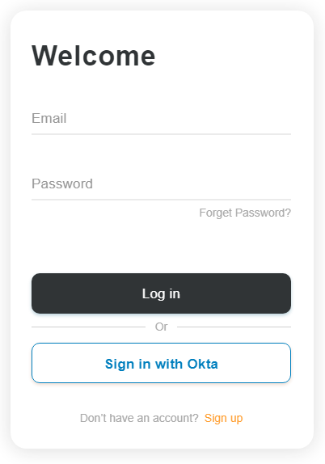

Lets define stuff and set some context...

[OpenId Connect](https://openid.net/connect/): is an authentication (identity) layer on top of [OAuth 2.0](https://en.wikipedia.org/wiki/OAuth#OAuth_2.0).

Legacy backend: In this post's context, is any system which has its own user/identity management implemented and exposed as a bunch of services. In such an event, the front end implementation team cannot do much, in order to add custom functionality.

I have built a web front end (using ASP.NET MVC) for a legacy insurance backend, exposed via SOAP serivces, which has its own user/identity management in place. Now the challenge was to integrate an OpenId Connect provider for web users.

ASP.NET MVC application already uses a custom implementation of [Forms Authentication](https://docs.microsoft.com/en-us/aspnet/web-forms/overview/older-versions-security/introduction/an-overview-of-forms-authentication-cs); which already is obsolete!

Without going into much detail about what changes were done in the back end, at a very high level, we basically added 2 fields to Users table, namely IdentityProviderName & UserIdentityToken and adjusted the SOAP services accordingly. IdentityProviderName can be something like, auth0, okta, onelogin, pingidentity, etc. And UserIdentityToken will store the unique user identifier provided by OpenId Connect Provider (OP).

The user identification data from OP will be associated with an existing user account in our backend. This will enable us to perform an identity verification at OP and verify the received user identification token against our backend and allow a login.

We keep the custom FormsAuthentication unchanged, which means, the current user authentication mechanism must work as is. On top, we provide an additional mechanism to use an OpenId Connect based login. For this post, I'll use [okta](https://www.okta.com) OP, you can replace it with any OP of your choice.

I'll be using [authorization_code](https://www.oauth.com/oauth2-servers/access-tokens/authorization-code-request/) grant (or flow) as we are securing a web application.

Okta developer portal has fantastic documentation about OpenId Connect, see [Choosing an OAuth 2.0 flow](https://developer.okta.com/docs/concepts/auth-overview/#recommended-flow-by-application-type) for your integration requirement.

Lock image credit: <a style="background-color:black;color:white;text-decoration:none;padding:4px 6px;font-family:-apple-system, BlinkMacSystemFont, &quot;San Francisco&quot;, &quot;Helvetica Neue&quot;, Helvetica, Ubuntu, Roboto, Noto, &quot;Segoe UI&quot;, Arial, sans-serif;font-size:12px;font-weight:bold;line-height:1.2;display:inline-block;border-radius:3px" href="https://unsplash.com/@mr_williams_photography?utm_medium=referral&amp;utm_campaign=photographer-credit&amp;utm_content=creditBadge" target="_blank" rel="noopener noreferrer" title="Download free do whatever you want high-resolution photos from Micah Williams"><svg xmlns="http://www.w3.org/2000/svg" style="height:12px;width:auto;position:relative;vertical-align:middle;top:-2px;fill:white" viewBox="0 0 32 32"><title>unsplash-logo</title><path d="M10 9V0h12v9H10zm12 5h10v18H0V14h10v9h12v-9z"></path></svg>Micah Williams</a>
